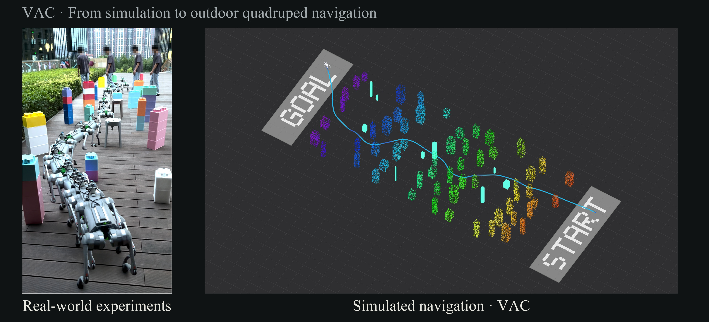
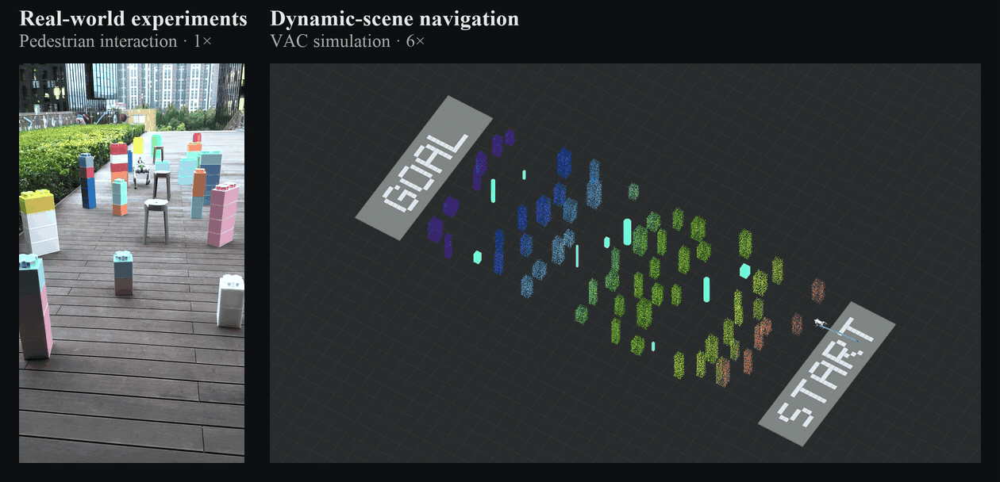
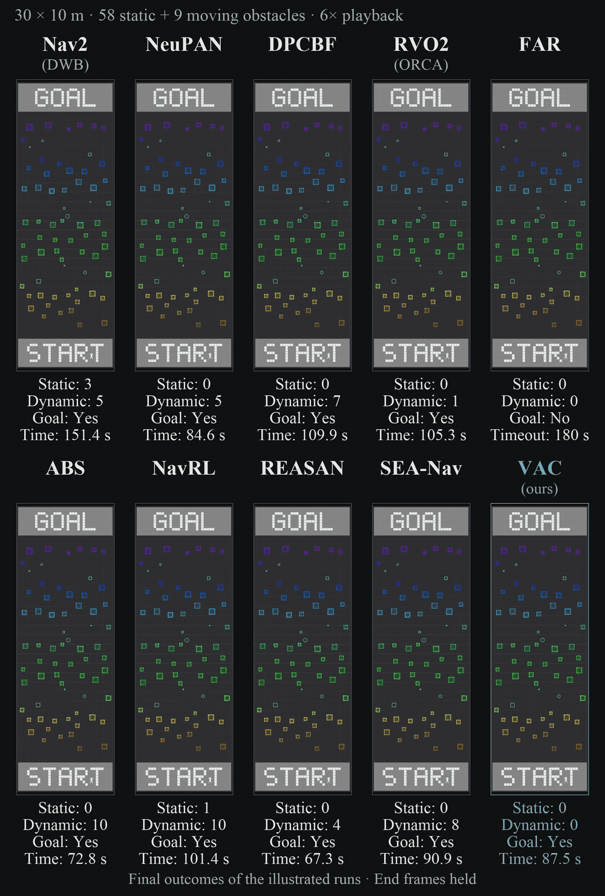
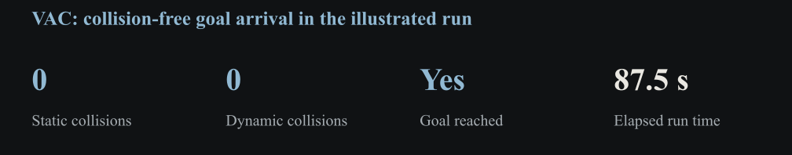
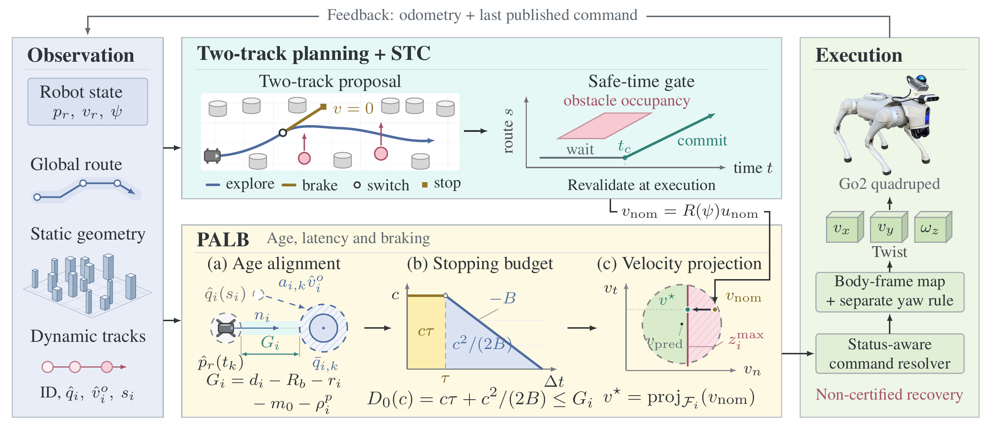
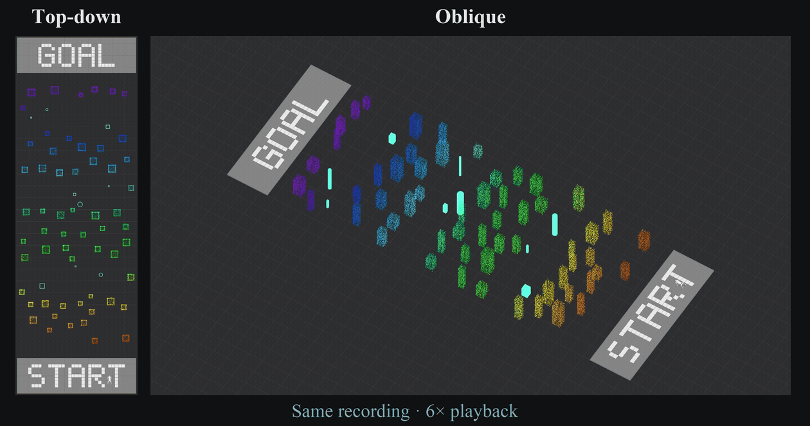
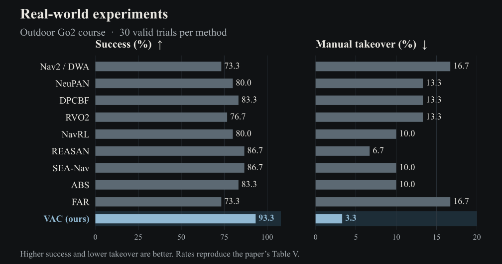
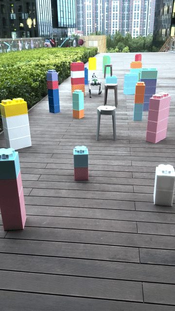
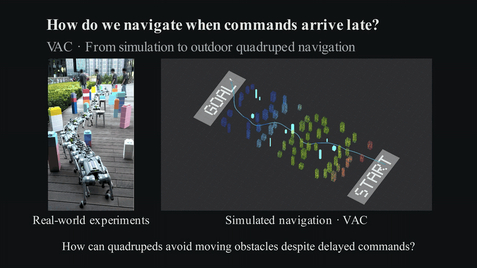

<h1 align="center">VAC: Coupling Temporal Planning and Velocity Filtering for Quadruped Navigation</h1>

  

Quadruped navigation in dynamic environments.

  <a href="#dynamic-preview">Demos</a> |
  <a href="#ten-method-comparison">Comparison</a> |
  <a href="#method">Method</a> |
  <a href="#simulation-and-real-world-results">Results</a> |
  <a href="#narrated-overview">Video</a>

> *VAC: Coupling Temporal Planning and Velocity Filtering for Quadruped Navigation* — submitted to IEEE ICRA 2027.

> [!IMPORTANT]
> This repository provides anonymous demo videos and supplementary results for peer review. **The full source code will be open-sourced upon acceptance.**

## Dynamic preview

  

<em>Real-world (1×) and simulation (6×) excerpts.</em>

## Ten-method comparison

Dynamic scene: **30 × 10 m** · **58 static obstacles** · **9 moving obstacles**.

<!-- VIDEO_SLOT: simulation_comparison -->

  

<em>Top-down · Synchronized 6× playback · One run per method; final frames held.</em>

  

Among these ten recordings, **VAC is the only method** that reaches the goal without a collision.

### Single-run outcomes

| Method | Static collisions ↓ | Dynamic collisions ↓ | Goal reached | Run time (s) ↓ |
| :--- | :---: | :---: | :---: | :---: |
| Nav2 (DWB) | 3 | 5 | **Yes** | 151.4 |
| NeuPAN | **0** | 5 | **Yes** | 84.6 |
| DPCBF | **0** | 7 | **Yes** | 109.9 |
| RVO2 (ORCA) | **0** | 1 | **Yes** | 105.3 |
| FAR | **0** | **0** | No | 180.0 (timeout) |
| ABS | **0** | 10 | **Yes** | 72.8 |
| NavRL | 1 | 10 | **Yes** | 101.4 |
| REASAN | **0** | 4 | **Yes** | **67.3** |
| SEA-Nav | **0** | 8 | **Yes** | 90.9 |
| **VAC (ours)** | **0** | **0** | **Yes** | 87.5 |

*Bold = column best, including ties. Counts are collision events per run; time is before playback acceleration. Goal arrival does not imply collision-free success.*

## Method

  

- **Temporal planning:** exploration and braking tracks, revalidated by the Safe-Time Contract.
- **Velocity filtering:** PALB aligns obstacle tracks to control time and projects velocities under obstacle and actuator constraints.
- **Delayed backup:** separation and execution-coverage conditions specify when filtered execution can share a common backup.

The analysis assumes a feasible relative-braking backup and full execution coverage; these conditions are not yet certified online.

## Simulation and real-world results

Aggregate paper results, separate from the demonstration runs.

### Simulation

Matched-filter evaluation with **240 trials per filter**.

| Evaluation | Reported result |
| :--- | :---: |
| VAC with PALB: collision-free goal-reaching rate | **87.9%** |
| Gain over the delay-aware CBF variant | **+5.0 percentage points** |
| PALB computation time: 95th percentile | **8.9 ms** |

#### VAC demonstration

<!-- VIDEO_SLOT: vac_simulation_top, vac_simulation_oblique -->

  

<em>Two synchronized views of the same 87.5 s run · 6× playback.</em>

### Real-world experiments

Outdoor Go2 course · **10 methods** · **30 valid trials per method**.

  

<em>Success and manual takeover · 30 trials per method.</em>

| Method | Success (%) ↑ | Static collisions ↓ | Dynamic collisions ↓ | Manual takeover (%) ↓ |
| :--- | :---: | :---: | :---: | :---: |
| Nav2 / DWA | 73.3 | 2 | 4 | 16.7 |
| NeuPAN | 80.0 | 1 | 3 | 13.3 |
| DPCBF | 83.3 | **0** | 2 | 13.3 |
| RVO2 | 76.7 | 1 | 4 | 13.3 |
| NavRL | 80.0 | 1 | 3 | 10.0 |
| REASAN | 86.7 | **0** | 2 | 6.7 |
| SEA-Nav | 86.7 | **0** | 2 | 10.0 |
| ABS | 83.3 | 1 | 2 | 10.0 |
| FAR | 73.3 | 1 | 2 | 16.7 |
| **VAC (ours)** | **93.3** | **0** | **1** | **3.3** |

*Complete Table V. Success requires goal arrival without collision or takeover. Collisions are event totals over 30 trials per method. Bold marks the best value, including ties.*

#### Real-world demonstration

<!-- VIDEO_SLOT: outdoor_full -->

  

<em>Pedestrian crossing · 1× · 10.5 s excerpt (14.4–24.9 s).</em>

## Narrated overview

English narration and subtitles · Full video: **2 min 59.9 s**.

<!-- VIDEO_SLOT: overview -->

  

<em>Silent 18 s preview · Six 3-second excerpts, each at its original speed.</em>

