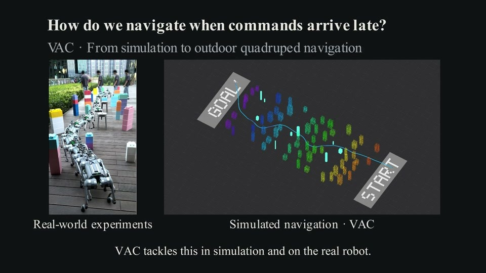
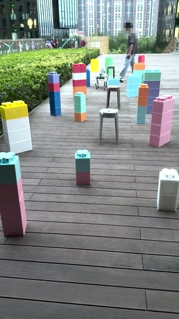
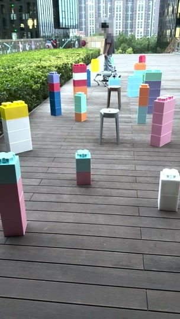
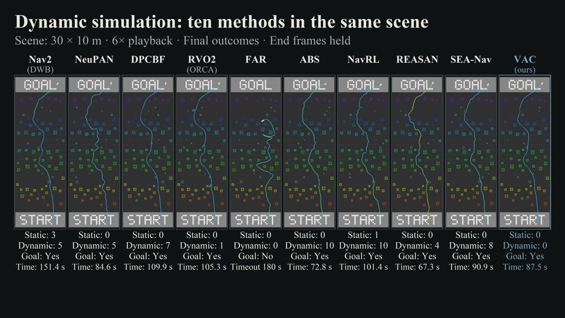
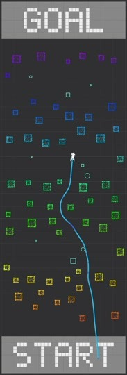
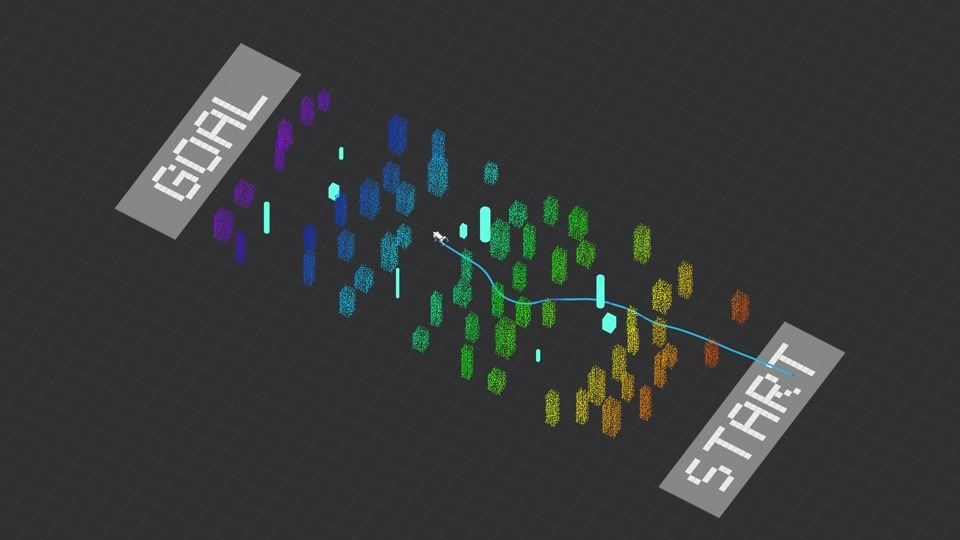
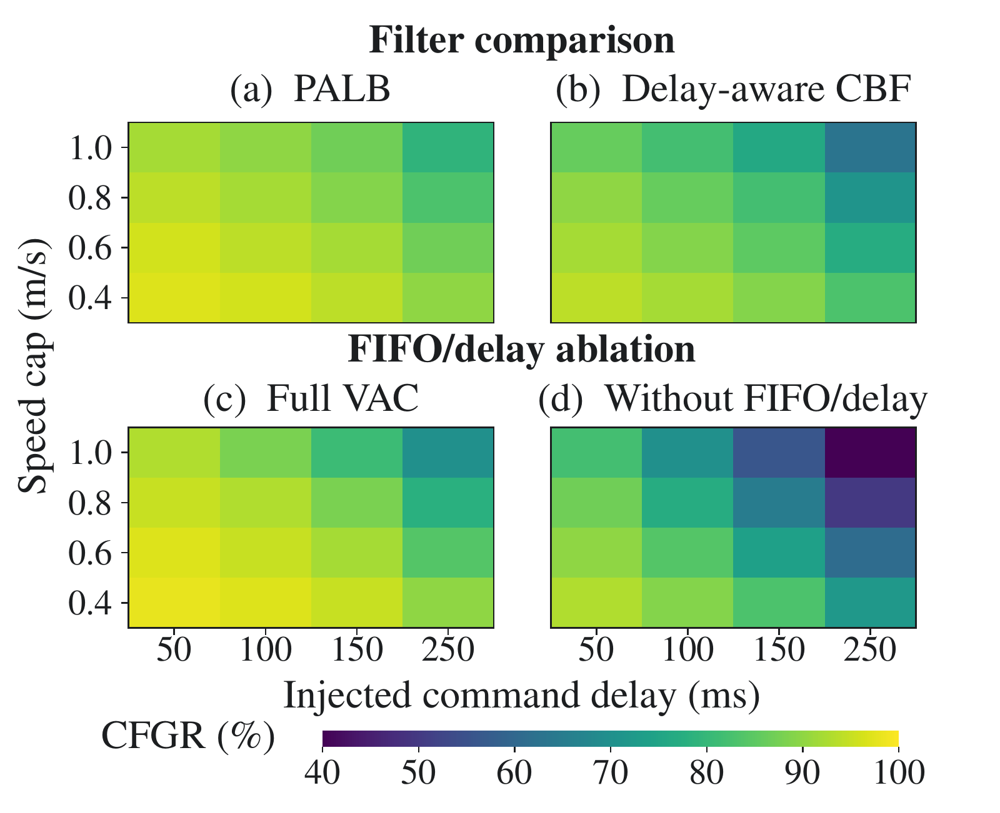
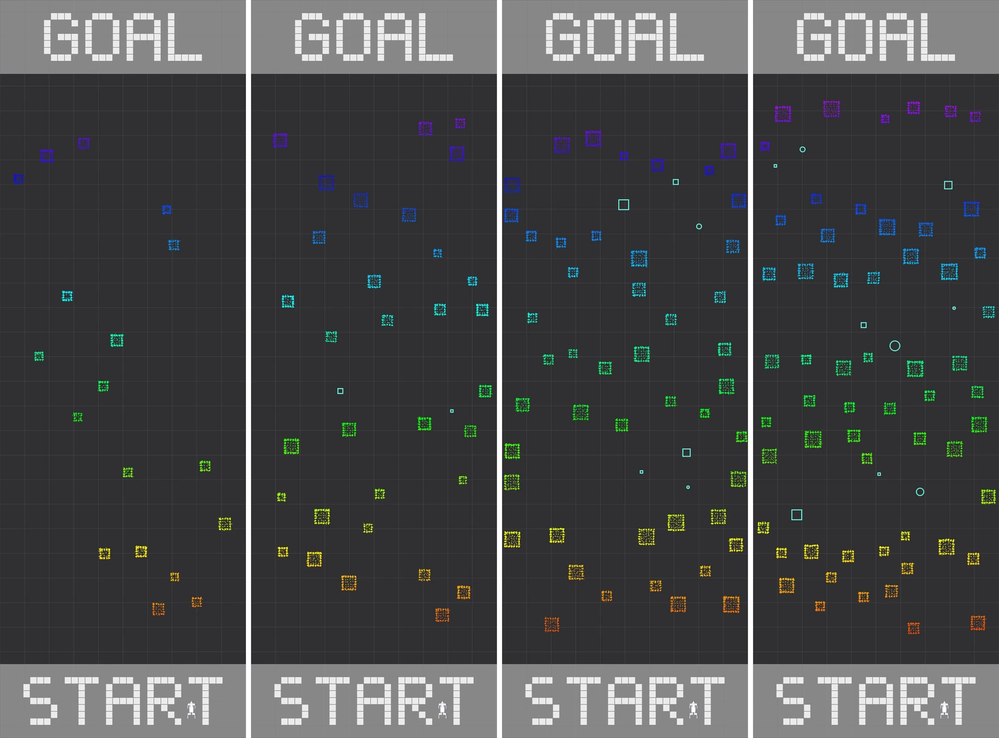

# VAC: Coupling Temporal Planning and Velocity Filtering for Quadruped Navigation

**Anonymous supplementary materials**

VAC couples temporal revalidation with age-aligned velocity filtering for quadruped navigation among moving obstacles, accounting for command delay and braking constraints.

## Code Availability

Demo videos are provided below. **The source code will be released upon acceptance of the paper.**

## Overview

A narrated overview of the problem, method, simulation comparison, and outdoor experiments (2 min 59.9 s). English captions are included in the video; an [SRT file](assets/subtitles/overview_en.srt) is also available.

[Watch or download the overview](assets/videos/overview.mp4)

Click a thumbnail or video link to open its MP4 file. If the repository viewer does not play the file inline, use its download control and open the video locally.

## Real-world Experiments

Outdoor Go2 navigation among static obstacles and a moving pedestrian. Both clips play at **1× speed**. The short clip is an excerpt from the same recording as the full clip, not an additional trial.

| Complete recording (25.0 s) | Pedestrian interaction excerpt (10.5 s) |
| :---: | :---: |
|  |  |

## Simulation Comparison

Ten methods in the same **30 × 10 m dynamic scene**, with **58 static obstacles and 9 moving obstacles**. All recordings use **6× playback**; START is at the bottom and GOAL at the top. Each panel shows one illustrative run. Shorter recordings hold their final frame until the comparison ends.

[Watch the comparison (31 s)](assets/videos/simulation_comparison.mp4) · [Single-run results and definitions](docs/demo_details.md) · [Results in JSON](assets/data/example_run_results.json)

## Full VAC Run

Two views of the same VAC recording, shown at **1× speed** (87.5 s). The reported outcome for this example is **goal reached, 0 static collision events, and 0 dynamic collision events**. The top view is cropped to the complete course and rotated for a START-bottom / GOAL-top orientation; no time segments are removed. The oblique view is resized without changing its aspect ratio.

| Top-down view | Oblique view |
| :---: | :---: |
|  |  |

The simulation videos visualize recorded navigation states. They illustrate trajectories and obstacle interactions; the rendered replay does not establish contact-dynamics or gait-fidelity validation.

## Method

The planner proposes exploration and braking tracks. Temporal revalidation checks the timing of execution, while PALB aligns obstacle states to control time and filters the requested velocity using a delayed-braking clearance budget.

The analysis is conditional on a feasible relative-braking backup and full execution coverage. These conditions are not yet certified online.

## Evaluation Context

The paper reports **87.9% collision-free goal-reaching rate** for VAC with PALB in the matched-filter study (240 trials per filter), **5.0 percentage points** above the delay-aware CBF variant. PALB's 95th-percentile computation time is **8.9 ms**. The outdoor evaluation reports **93.3% success** and **3.3% manual takeover**, with 30 trials per method.

These aggregate results are separate from the individual recordings shown above. Goal arrival alone does not imply collision-free arrival.

Four simulation difficulty levels, from left to right: Easy, Medium, Hard, and Hardest. The comparison video above is one scene example, not four difficulty-level recordings.

